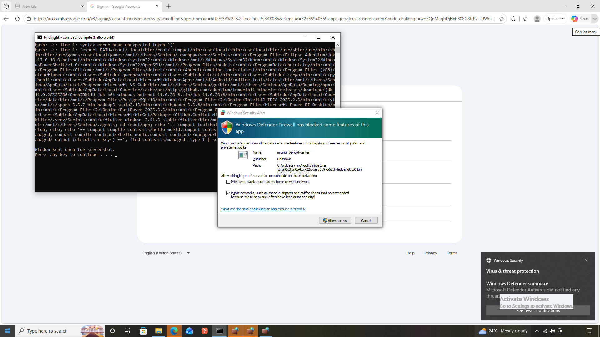
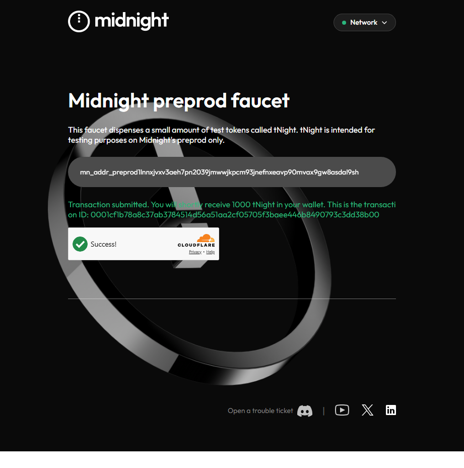
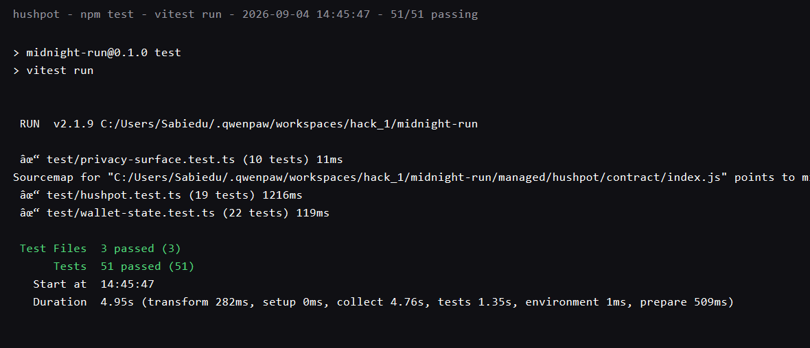
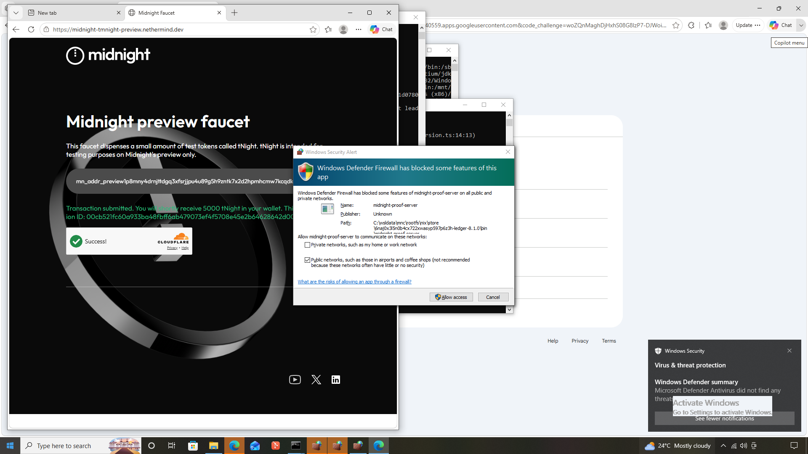

# HushPot
> Private group savings pots on Midnight — pledge amounts stay secret; the pot only proves you've met the minimum.

## Contract Address
| Network | Address | Deploy Tx | Block |
|---------|---------|-----------|-------|
| Preview  | [PASTE ADDRESS AFTER DEPLOY] | — | — |
| Preprod  | `b14415c2f686ea1ab2dee103876cc3c2012830bc6a5e56a48d87f013c6f4abb4` | `0260d4a06756e8e955679f5493a9b66ba58a4d1901cea137dcc977e762e191ae` | 2,401,203 |

## What This Does
HushPot is a group savings pot in the esusu / ajo tradition: a host opens a pot with a fixed capacity (number of seats) and a minimum pledge, members join and put money in while entries are open, the host closes entries, and valid members claim from the pot afterwards.

What makes it a Midnight dApp is the disclosure boundary. The pot itself lives on-chain and everyone can see the pot-level facts — whether entries are open or closed, how many seats are taken, whether a member's claim is valid. But each member's pledge **amount** is never published: it exists only in the member's wallet as a private witness and crosses the chain solely as a salted commitment. A member can prove "my pledge is at least the threshold" without ever revealing the number.

## Privacy Model
- **PUBLIC (on-chain):** pot open/closed state, capacity, minPledge threshold value, membership set (member commitments — addresses are never stored, only anchors), claim validity, and pot-level counters/totals (member count, claim count, claimed total at settlement).
- **PRIVATE (witness, never on-chain):** `localPledgeAmount` (each member's actual pledge amount) and `localSk` (member secret key). Both live only in the member's wallet; the chain sees salted hashes at most.
- **PROVES without revealing:** `provePledgeAtLeast` — a member proves their committed pledge ≥ a threshold without disclosing the amount (or the threshold). The circuit writes nothing to the ledger; a successful proof *is* the statement.

## Tech Stack
- Midnight network (Preview / Preprod)
- Compact smart-contract language, `compactc` 0.31.1
- TypeScript + midnight-js 4.1.1 (contract bindings, wallet, deploy driver)
- Node.js 22, Vitest
- Docker — Midnight proof server (and optional local devnet)

## Prerequisites
- Node.js ≥ 22
- Docker (proof server; optional local devnet)
- Lace wallet — optional at L1 (contract + CLI lifecycle only)
- On Windows: WSL2 with an Ubuntu distro — `compactc` has no native Windows build; `npm run compile` drives it through WSL automatically

## Setup
```bash
# 1. Install dependencies
npm install

# 2. Compile the contract (contracts/hushpot.compact -> managed/hushpot)
npm run compile

# 3. Run a local proof server on port 6300 (required for testnet transactions)
docker run -d -p 6300:6300 midnightntwrk/proof-server:latest
# repo helper alternative (ledger 8.1.0 proof-server under WSL):
#   wsl -d mnc -u root -- bash tools/run-proof-server.sh

# 4. Configure the deployer seed (gitignored — never commit funded seeds)
cd deploy
cp .env.preprod.example .env.preprod
#    then set MIDNIGHT_PREPROD_SEED to a real 64-hex-char seed

# 5. Fund and deploy to Preprod
npm run hushpot:address   # prints the unshielded address -> fund via the Preprod faucet
npm run hushpot:deploy    # syncs the wallet, waits for funds, deploys HushPot
```

Optional:
- `npm run hushpot:lifecycle [address]` — drive the full group-pot story on-chain (join → pledge → prove → close → claim)
- `npm run hushpot:demo` — deploy + lifecycle in one run
- `MIDNIGHT_NETWORK=local|preview|preprod` selects the target (default `preprod`)
- `docker compose up --wait` in `contract/` boots a local devnet (node + indexer)

## Run Tests
```bash
npm test
```
51 tests, all green: circuit logic and state transitions (19), privacy surface — private inputs are never exposed on-chain (10), and wallet-state persistence across restarts (22).

## Initial Idea
HushPot brings esusu — the West African group savings tradition — onto Midnight, minus the part where everyone can see everyone's money. Each member's pledge amount is a private witness: the pot proves you've met the minimum without ever revealing what you actually put in, and claims settle without exposing who held how much. Only what must be verifiable stays public — the pot is funded, the round closed, the claim valid. For every community where savings participation is sensitive information.

## Screenshots
Circuits compiling (`npm run compile`):



Preprod faucet funding the deployer wallet with 1000 tNIGHT:



Test suite passing — 51/51 (circuit logic & state transitions, privacy surface, wallet-state persistence), run 2026-09-04 14:45:



Deployed contract address on Preprod, verified on the public indexer (deploy tx `0260d4a0...e191ae`, block 2,401,203):


